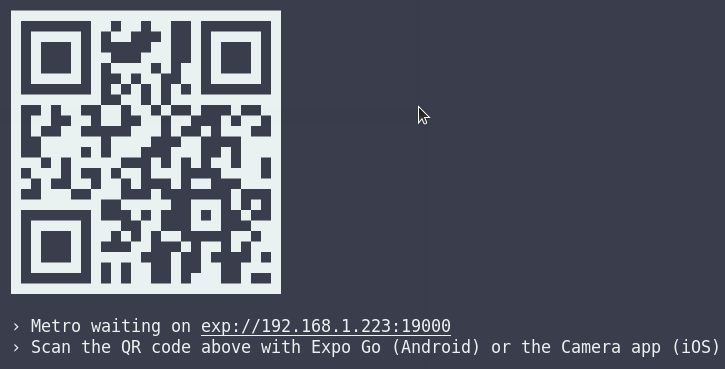

# Swapify

A mobile app build for people who want to exchang items between each other with no monetary involvement. The goal of this project was to build a platform that won't charge you for listing your items and everybody can browse between the items and making swaps.

## Meet the team

- Rafal Ney
- Laura Thomason
- Nenad Tsvetanovski
- Rayhaan Ugharadar
- Rosie Vallely

---

## Watch demo

If you want to learn more about this project and watch our demo follow the link bellow
https://youtu.be/lAhZAQDOVWA

---

## Tech stack

- React Native
- Expo
- Firebase firestore
- Firebase authetication
- Trello
- Excalidraw
- Git & GitHub

---

## Basic requirements

To run this app on your computer, make sure you have version [**NodeJS v16.11.0**](https://nodejs.org/en/) and [**Git**](https://git-scm.com) installed.

---

## Download

You can find the repository on [**GitHub**](https://github.com/RafalNey/Swapify) and clone it down or just download the ZIP file.

```
git clone https://github.com/RafalNey/Swapify

```

---

## Installation

First thing you need to do is install Expo globally.

```
npm install --global expo-cli
```

Once you have the repository on your computer, navigate to that repository in your terminal and install the npm packages.

```
npm install
```

---

## Run app

There are few ways you can run this app:

- Have an iOS or Android emulator
- Run it in the web browser
- Run it on your mobile device through [**Expo Go**](https://expo.dev/client) which you can find in App Store/Google Play

---

## Run with Expo Go

First you need start the app.

```
expo start
```

---

Then it will give you a QR code in the terminal that you can scan with your phone using Expo Go and that's it your app is live and ready to build!



---
